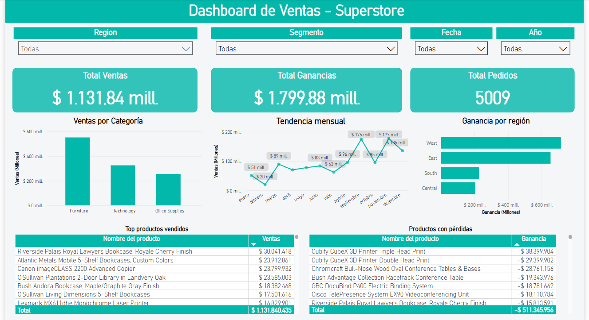

# 📊 Análisis de Ventas - Superstore

Este proyecto muestra un análisis completo de un dataset real de ventas utilizando herramientas clave en el rol de analista de datos: **Python**, **SQLite**, **SQL** y **Power BI**. Se exploraron datos, se limpiaron, se cargaron en una base de datos relacional y finalmente se construyó un dashboard interactivo.

---

## 📁 Estructura del proyecto

```bash
superstore-proyecto/
│
├── data/
│ └── Superstore.csv # Dataset original
│ └── Superstore_limpio.csv # Dataset limpio listo para usar
│
├── db/
│ └── superstore.db # Base de datos SQLite con tabla 'ventas'
│
├── notebooks/
│ └── EDA_superstore.ipynb # Exploración y limpieza en Python
│
├── dashboard/
│ └── SuperstoreDashboard.pbix # Dashboard en Power BI
│
└── README.md 
```

---

## ⚙️ Cómo ejecutar el proyecto

### 🔹 Requisitos previos

Asegúrate de tener instaladas las siguientes herramientas:

- [Python 3.9+](https://www.python.org/downloads/)
- [Power BI Desktop](https://powerbi.microsoft.com/)
- [VSCode o Jupyter Notebook](https://code.visualstudio.com/)
- (Opcional) SQLite para consultas SQL

### 🔹 Pasos para ejecutar el análisis


```bash
git clone https://github.com/AlexanderValencia21/An-lisis-de-Ventas---Superstore.git
cd superstore-analisis

python -m venv venv
source venv/bin/activate      # Linux/macOS
venv\Scripts\activate         # Windows

pip install -r requirements.txt
```
Y correr el notebook de Jupyter

---

## 🚀 Objetivos

- Aplicar herramientas reales de análisis de datos de principio a fin.
- Explorar y limpiar datos con Python.
- Almacenar los datos en una base de datos relacional y practicar consultas SQL.
- Construir un dashboard atractivo e interactivo con Power BI.

---

## 🧪 Herramientas utilizadas

| Herramienta | Uso |
|------------|-----|
| `Python (pandas, matplotlib, seaborn)` | Limpieza y análisis exploratorio |
| `SQLite + SQL` | Carga de datos y consultas |
| `Power BI` | Visualización de resultados y dashboard |

---

## 📊 Análisis exploratorio (EDA)

Desde Python se realizaron los siguientes análisis:

- Distribución de ventas y ganancias
- Top productos vendidos
- Productos con pérdida
- Ventas por categoría, región y segmento
- Tendencias mensuales de ventas

> Los resultados se utilizaron para definir las visualizaciones clave del dashboard.

---

## 🗄️ Modelo de datos (SQL)

Los datos se cargaron en una base SQLite, lo que permitió ejecutar consultas como:

```sql
SELECT category, ROUND(SUM(sales), 2) AS ventas
FROM ventas
GROUP BY category
ORDER BY ventas DESC;
```

---

## 📈 Dashboard en Power BI


